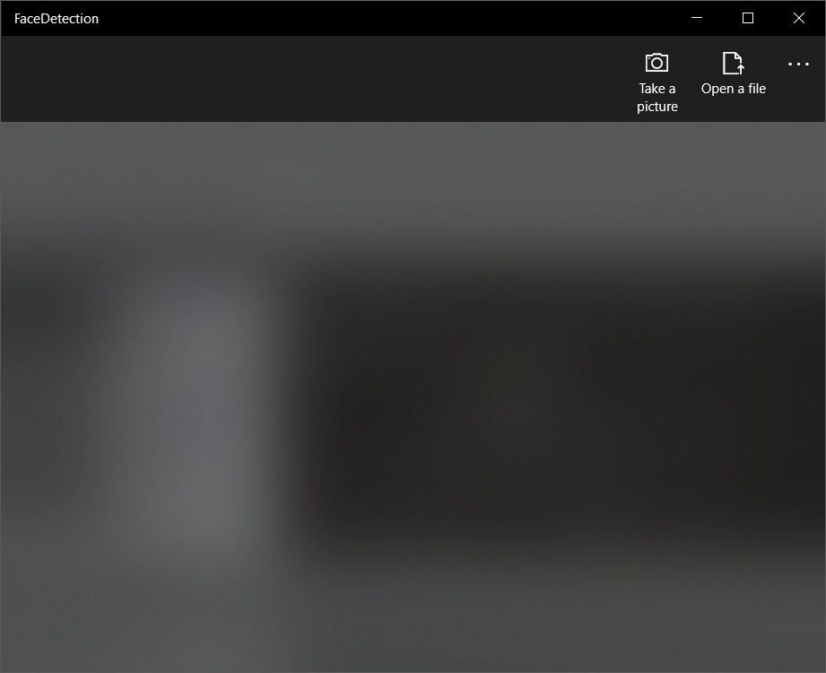
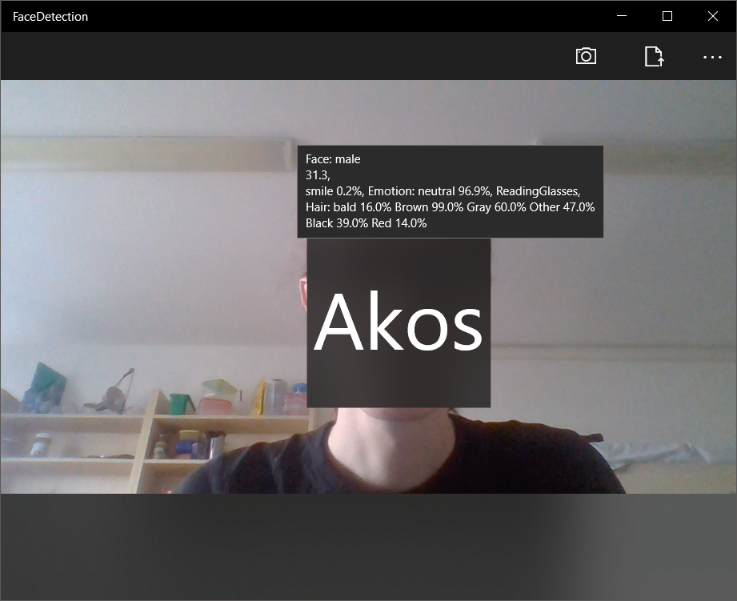
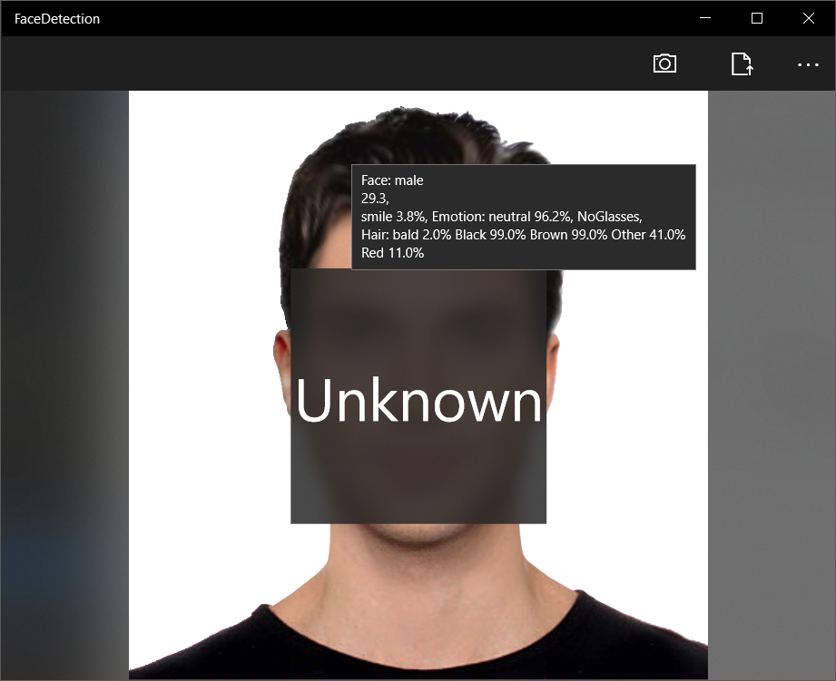

# UWPFaceDetector
This is a Universal Windows Platform application. It's capable to recognise a previously given persons face from a photograph, taken by the camera or uploaded from file. The app uses Microsofts Azure service for image processing. It only handels uploading and datapresentation. Photographs from the person to recognise should be placed under the folder `Assets/admin/`

